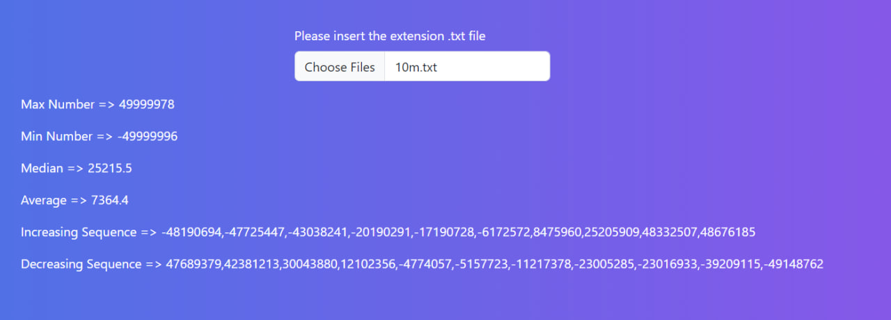

# Number Determiner

Number Determiner is a web application written in vanilla JavaScript that allows you to perform operations to find the minimum and maximum numbers, the arithmetic mean, and the median for a set of numbers loaded from a text file.

## Usage

1.  **Upload a file with numbers**: Click the "Choose File" button and select a text file containing numbers to upload.
2.  **Perform operations**: After successfully uploading the file, you will see the result of the web application

## How to run the project locally

    `https://github.com/ishkov2709/number-determiner.git`

Open the `index.html` file in your browser.

## Demo

A demo of the project is available at [this link](https://ishkov2709.github.io/number-determiner/).

## Author

Author: Dmitry Ishkov
